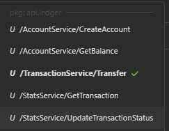

# High-Load Distributed Ledger Core

Высокопроизводительное ядро платежной системы с обработкой транзакций через gRPC и гарантией идемпотентности через Redis.

## Быстрый старт


```bash
# клонирование репозитория 
git clone https://github.com/yhgrwav/high-load-ledger.git

# переключение на директорию проекта
cd high-load-ledger

# копирование шаблона конфигурации
# далее необходимо вручную настроить все предложенные поля
cp .env.example .env
```
```bash
# собрать и запустить приложение 
docker compose up -d --build
```
## ДИСКЛЕЙМЕР 
Для упрощения процесса разработки я пишу всё сразу в dev ветку и если убеждаюсь что код написан без ошибок или багов, то сразу пушу. Dev ветка выбрана основной для того, чтобы трекер активности на github видел все мои коммиты в течение 2 минут после отправки коммитов, а не после мержа в main ветку, **ЭТО ОСОЗНАННЫЙ ВЫБОР**. Естественно у меня есть понимание и опыт разработки с идиоматичным подходом, но так как разрабатываю я проект один, то я решил упростить работу с гитом до такого уровня. После того как проект будет реализован до минимально удовлетворительного уровня - я всё верну в общепринятый вид.   

### Список gRPC и HTTP эндпоинтов
###  gRPC ручки (update status - mock)

### localhost:3000 (admin, admin) - grafana
### localhost:6767/metrics - prometheus

### Posting Worker
Фоновый воркер верифицирует балансы аккаунтов батчами по `postings.id`. Настраивается через `.env`:
- `POSTING_WORKER_ENABLED` — включить/выключить
- `POSTING_WORKER_NAME` — имя воркера (ключ курсора в БД, обязательно при enabled=true)
- `POSTING_WORKER_BATCH_SIZE` — размер батча postings
- `POSTING_WORKER_BACKOFF` — пауза при отсутствии новых postings


## Примеры gRPC-запросов

### Создание аккаунта №1
```json
{
  "user_id": "VQ6EAAKbQdSnFkRmVUQAAA==",
  "currency": "CURRENCY_USD"
}
```

### Создание аккаунта №2
```json 
{
  "user_id": "mx3rTbt9S62b3SsNez3LbR==",
  "currency": "CURRENCY_USD"
}
```

### Перевод средств
```json
{
  "idempotency_key": "0pDx7mxUSwGQ5tcBdI8IUQ==",
  "user_from_id": "VQ6EAAKbQdSnFkRmVUQAAA==",
  "user_to_id": "mx3rTbt9S62b3SsNez3LbR==",
  "amount": 500,
  "currency": "CURRENCY_USD"
}
```

### Проверка баланса
```json
{
  "account_id": "VQ6EAAKbQdSnFkRmVUQAAA==",
  "requester_id": "VQ6EAAKbQdSnFkRmVUQAAA=="
}
```

## План развития (Roadmap)
- [x] Protobuf контракты и миграции
- [x] Чистая архитектура
- [x] AccountService и TransactionService
- [x] PostingWorker (фоновая верификация балансов)
- [x] Prometheus метрики и Grafana дашборды
- [ ] StatsService (получение транзакций, обновление статуса)
- [ ] Unit и интеграционные тесты
- [ ] Интеграция с Apache Kafka для асинхронной обработки
- [ ] OpenTelemetry трассировка
- [ ] Шардирование PostgreSQL
- [ ] Kubernetes манифесты
